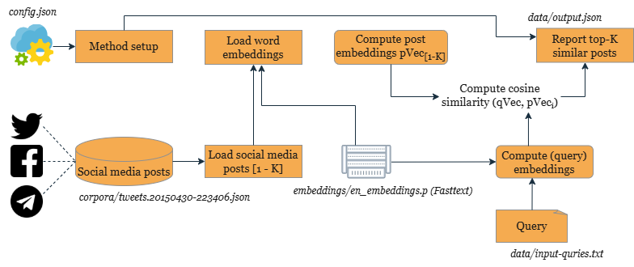

# Semantic Search Over Social Media Posts (Tweets)

[](https://notebooks.gesis.org/binder/v2/gh/BDA-KTS/semantic-search-over_social-media-posts/HEAD?labpath=semantic-search-over_social-media-posts.ipynb)

---
## Description
This method allows users to perform a semantic search across a collection of social media posts (e.g., tweets) and retrieve the most relevant posts for a given query. For example, a social scientist studying public discourse on topics like *social media*, *gender issues*, or *elections* can use this tool to identify posts that share a similar meaning to the input query.


- **[How to Use](#how-to-use):** Detailed instructions for setting up the environment, configuring the method, and running the script.
- **[Reproducibility](#Reproducibility):** Information about the actual implementation and reproduction of the method.

### Usecase(s)
This method supports all use cases that require finding tweets (or other social media posts) for a specific topic, entity, or keyword.

For example, one use case explores how users express emotions and build social connections on Twitter. By analyzing tweets for emotional sentiment, interaction patterns, and cultural references, researchers can uncover insights into individual well-being, community dynamics, and cultural identity trends.

### Keywords
*text similarity, semantic similarity search, cosine similarity, text retrieval*

---

## How to Use


### Prerequisites
- **Python v3.8** (preferably through Anaconda)
- This method requires a collection of social media posts in `JSON` format. Place the collection in the `corpora/` folder and update the file name in the `config.json` to point to your dataset (e.g., `tweets.20150430-223406.json`). For demonstration purposes, the method uses a sample dataset of NLTK tweets located in `corpora/tweets.20150430-223406.json`.
### Steps to Execute
1. **Set up a Virtual Environment**
   - Using Anaconda:
     ```bash
     >conda create -n semantic_search python=3.8
     >conda activate semantic_search
     >conda install -c conda-forge notebook
     >pip install -r requirements.txt
     ```
   - Using Python:
     ```bash
     >python -m venv semantic_search
     >cd semantic_search
     >Scripts\activate
     >cd ..
     >pip install -r requirements.txt
     ```
2. **Run Jupyter Notebook**
   - Start Jupyter Lab or Notebook:
     ```bash
     >jupyter lab
     ```
   - Open and execute all cells in `lookup_socialmedia_posts.ipynb`.
3. **Update Inputs**
   - Add new queries (one per line) in `data/input_queries.txt`.
   - Update the path to your JSON collection in `config.json`.
4. **View Outputs**
   - Results are saved in `data/output.json`, including post IDs, text, and similarity scores.
  
### Input and Output Specification (With sample)
#### **Input**
- **User Query:** The easiest way to change the query is by editing the `/data/input_queries.txt`.
  - **Example Query:** The current file contains the following keywords:  
    - `Social Norms`  
    - `Cultural Identity`  
    - `Community Interaction`

 
  These keywords will be used to find tweets relevant to these topics in the dataset.

- **Input Dataset:** It can be social media posts in json format e.g., [Tweets](https://developer.x.com/en/docs/x-api/data-dictionary/object-model/tweet). We use NLTK sample tweets (`corpora/tweets.20150430-223406.json`) for demonstration.

#### **Output:**
- **Output Format:**  
  After running all the scripts in `semantic-search-over_social-media-posts.ipynb`, the results will be saved as a JSON file in the following location:  
  - **File:** `/data/output.json`  

- **Structure of Output:**  
  Each result in the JSON output file includes the following fields:  
  - `Post ID`: The unique identifier of the social media post.  
  - `Post Text`: The content of the post.  
  - `Similarity Score`: A numerical value (ranging from 0 to 1) indicating how closely the post matches the input query.  

- **Sample Output:**  
Below are the top-K most similar posts to the given query (with top-K set to 5 in this example):

```json
  {
    "social media": [
      {
        "post ID": "13567",
        "post text": "There's something a bit \"dad dancing\" about the way the Tories try to electioneer via social media https://t.co/WH0cmv76VD",
        "sim score": "0.9372139191497816"
      },
      {
        "post ID": "9732",
        "post text": "It's extremely comforting to know that the power of mainstream media has been diluted by social media? #SNP",
        "sim score": "0.9371564729455584"
      },
      {
        "post ID": "18324",
        "post text": "@mmaher70 @RichardJMurphy So why cant they defend the position thats just total incompetence constantly allow Tories to set agenda esp media",
        "sim score": "0.918129503287474"
      }
    ],
    "women": [
      {
        "post ID": "287",
        "post text": "RT @macplus4: And. Miliband stumbled. Much bigger issues to discuss - NHS, mental health, foodbanks, homelessness, usual cuts to women &amp; ch…",
        "sim score": "0.9999048991755727"
      },
      {
        "post ID": "2902",
        "post text": "Pigs sweat, men perspire https://t.co/6ZIU37HYPh",
        "sim score": "0.7674937266310939"
      }
    ],
    "election": [
      {
        "post ID": "19237",
        "post text": "#ELECTION2015 https://t.co/WgCyxkkAkc",
        "sim score": "0.9999999995861624"
      },
      {
        "post ID": "14156",
        "post text": "#NigelFarage #UKIP #Election2015 http://t.co/oyr8o5aJCv",
        "sim score": "0.99999999834465"
      }
    ]
  }
```

---
## Reproducibility
The method reads search queries from `data/input_queries.txt` (with one query per line) and writes the top-K most similar posts to `data/output.json`. It uses [Fasttext embeddings](https://dl.fbaipublicfiles.com/fasttext/vectors-english/wiki-news-300d-1M.vec.zip) loaded from `embeddings/en_embeddings.p` to get word/token embeddings that are averaged to compute post/document embeddings.

Users can customize the behavior of the method by specifying their preferences and paths to resources in the `config.json` file. It assists in replicability by allowing to execute the method under different settings e.g., with different posts collection, different value of top-K and with/without cleaning. Furthermore, working environment of the method is preserved in `requirements.txt` file, `random seed variables` are defined and the necessary details to reuse the method are provided in `How to Use`, in this document.

### Configuration Settings
Update `config.json` to adjust parameters like `input_query_filepath`, `top-K`, or preprocessing options (`"ifpreprocess": true/false`).

### Random Seed Control
The method includes predefined random seeds to ensure reproducibility of results across executions.

### Requirements and Environment
The environment details are provided in `requirements.txt`. Running the `pip install` command ensures all necessary packages are installed.

### Interactive Environment:  
To easily run and explore the method in a pre-configured environment, you can use Binder. It allows you to execute the notebook without needing to set up the environment locally. Click the badge below to get started: 

   [](https://notebooks.gesis.org/binder/v2/gh/BDA-KTS/semantic-search-over_social-media-posts/HEAD?labpath=semantic-search-over_social-media-posts.ipynb)

   

### Hardware Details
Average runtime: 1-2 minutes for 5000 posts on an 11th Gen Intel Core i7 processor with 16GB RAM (Windows 10).

---


## Contact Details
For questions or feedback, contact Fakhri Momeni via Email: fakhri.momeni@gesis.org.
