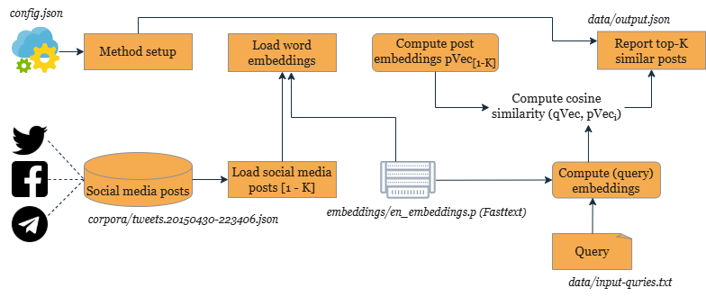

## Reproducibility
The method reads search queries from `data/input_queries.txt` (with one query per line) and writes the top-K most similar posts to `data/output.json`. It uses [Fasttext embeddings](https://dl.fbaipublicfiles.com/fasttext/vectors-english/wiki-news-300d-1M.vec.zip) loaded from `embeddings/en_embeddings.p` to get word/token embeddings that are averaged to compute post/document embeddings.

Users can customize the behavior of the method by specifying their preferences and paths to resources in the `config.json` file. It assists in replicability by allowing to execute the method under different settings e.g., with different posts collection, different value of top-K and with/without cleaning. Furthermore, working environment of the method is preserved in `requirements.txt` file, `random seed variables` are defined and the necessary details to reuse the method are provided in `How to Use`, in this document.

### Configuration Settings
Update `config.json` to adjust parameters like `input_query_filepath`, `top-K`, or preprocessing options (`"ifpreprocess": true/false`).

### Random Seed Control
The method includes predefined random seeds to ensure reproducibility of results across executions.

### Requirements and Environment
The environment details are provided in `requirements.txt`. Running the `pip install` command ensures all necessary packages are installed.

### Interactive Environment:  
To easily run and explore the method in a pre-configured environment, you can use Binder. It allows you to execute the notebook without needing to set up the environment locally. Click the badge below to get started: 

   

   

### Hardware Details
Average runtime: 1-2 minutes for 5000 posts on an 11th Gen Intel Core i7 processor with 16GB RAM (Windows 10).

---
